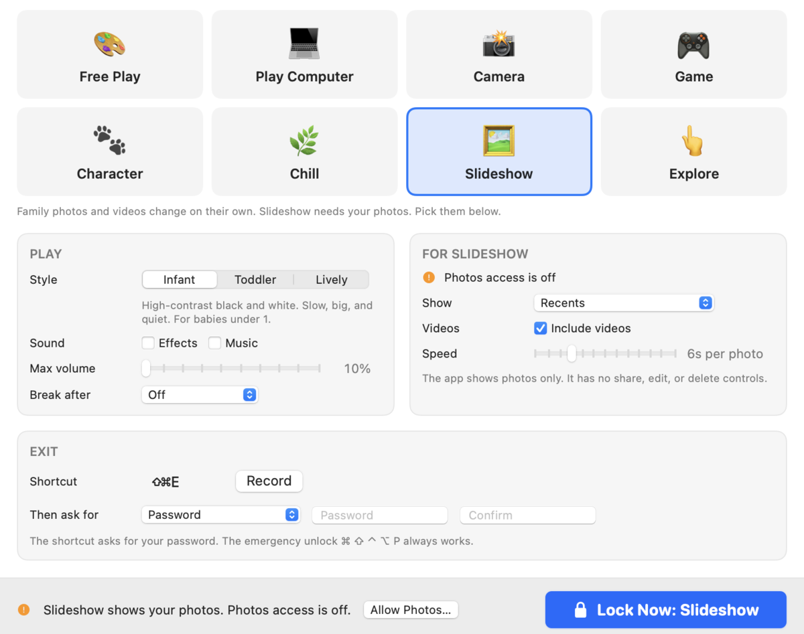
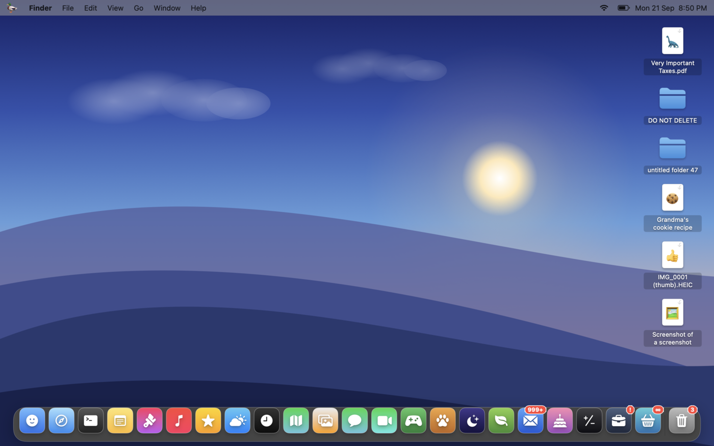
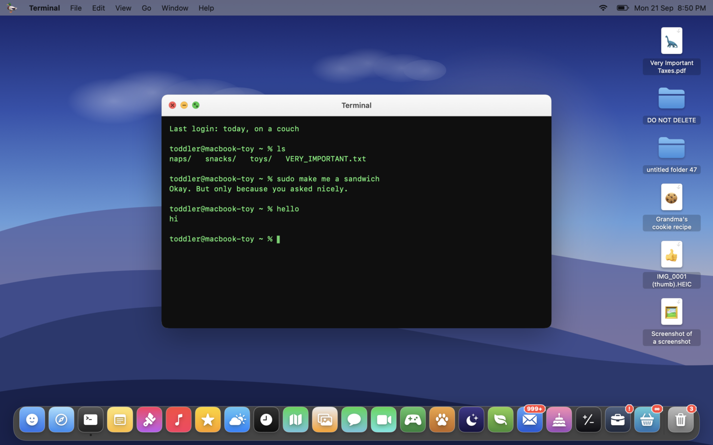
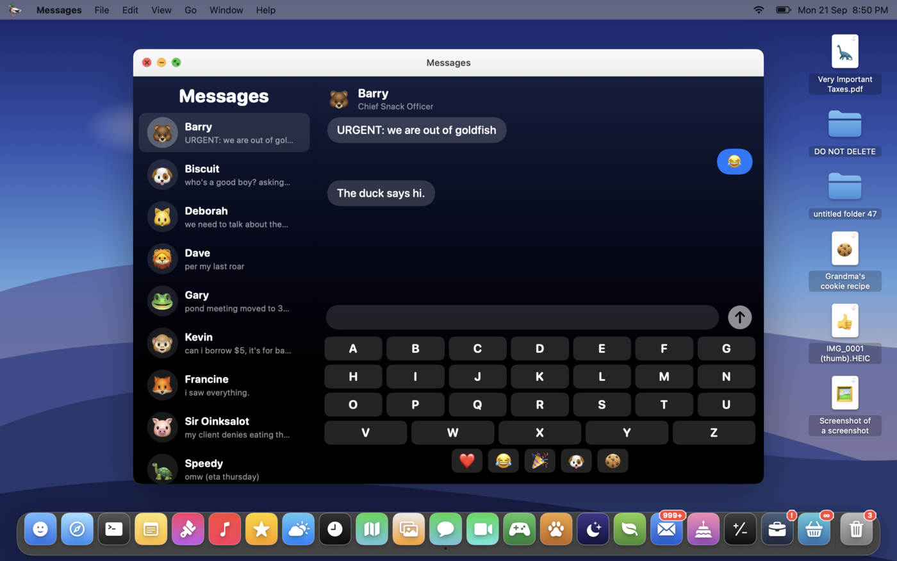
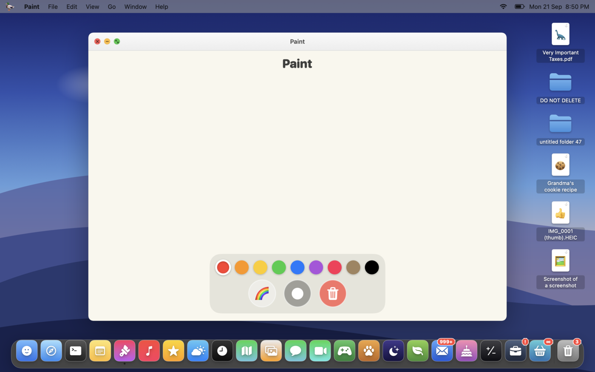
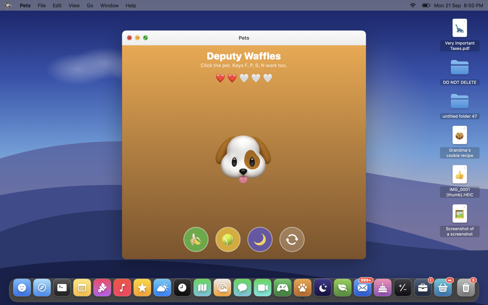
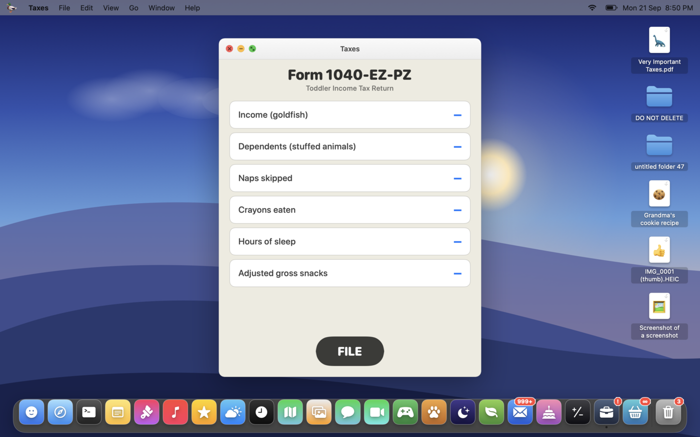

# Toddler Mode for Mac

> **Kid-proof your MacBook in one click.** A free, open-source macOS app that locks the screen into toddler-safe play: a pretend Mac with toy apps, camera play, kid-safe family photos, and colorful keyboard-mashing. Companion to [Toddler Mode for iPhone](https://happyduckling.app/toddlerapp/).

[](https://github.com/js1664/Toddler-Mode-for-Mac/releases)
[](LICENSE)
[](https://github.com/js1664/Toddler-Mode-for-Mac)
[](https://github.com/js1664/Toddler-Mode-for-Mac)

---

## Why Toddler Mode?

Every parent with a MacBook knows the moment: your toddler lunges for the keyboard, mashes keys, and suddenly you've sent a half-written email, opened 14 browser tabs, and enabled VoiceOver. **Toddler Mode locks your entire Mac** — keyboard shortcuts, trackpad gestures, Mission Control, Dock, menu bar, Cmd-Tab, volume keys, brightness keys — **everything**. Your kid gets a pretend Mac of their own, a camera to play with, the family photos, or colorful letters and sounds. Your real Mac stays safe.

No subscription. No account. No data collection. Just a single app.

## Screenshots



**Play Computer**: a pretend Mac with a dock of 23 toy apps. Every app is harmless and nothing reaches the outside world.



| Terminal answers back | Messages with animal friends |
|---|---|
|  |  |

| Paint | Pets | Taxes (the jokes are for you) |
|---|---|---|
|  |  |  |

## Features

- **Blocks all input** — Cmd-Tab, Mission Control, Ctrl-Space, volume/brightness keys, trackpad gestures, hot corners — nothing gets through
- **Eight play modes:**
  - **Free Play** — Keys spawn colorful bouncing letters, clicks create shapes and particle effects, mouse movement leaves a rainbow trail
  - **Play Computer** — A pretend Mac: menu bar, wallpaper, desktop icons, a dock, and 23 little apps in real-looking windows (Finder, Safari, Terminal, Notes, Paint, Music, Weather, Maps, Photos, Messages, FaceTime, Games, Pets, Space, Garden, Mail, Treats, Calculator, Taxes, Laundry, Stickers, Clock, Trash). Every app is a toy; nothing reaches the outside world
  - **Camera** — The real camera picture with silly live filters, a shutter, and a shot counter. The capture session has no output, so nothing is ever saved
  - **Game** — Tap floating bubbles to pop them with a running score counter
  - **Character** — A friendly creature follows the mouse, jumps and spins on key presses, and leaves rainbow paw prints
  - **Chill** — Low-stimulation mode with soft colors, gently drifting emoji (fruits, vegetables, animals), a warm cursor glow, and subtle expanding rings on click — perfect for winding down
  - **Slideshow** and **Explore** — Family photos and videos from a parent-chosen source (Recents, Favorites, hand-picked photos, chosen albums, or everything except albums). Display-only: no share, edit, or delete anywhere
- **Play style** — Infant (high-contrast black and white, slow, big, quiet), Toddler, or Lively
- **Max volume cap and play timer** — Cap how loud the app can get; optionally end play with a calm break screen
- **Multi-language support** — Choose from Arabic, Chinese, English, Hebrew, Japanese, or Korean character sets
- **Musical key sounds** — Each key plays a pentatonic tone (always sounds pleasant)
- **Customizable exit shortcut** — Set any key combination (requires 2+ modifiers) to exit lock mode, then ask for nothing, a math question, or a password
- **Optional password protection** — Stored in the macOS Keychain
- **Menu bar control** — Lock with any mode from the menu bar icon
- **Notarized and signed** — Downloads are Apple-notarized so macOS won't block the app
- **100% free and open source** — MIT licensed, no ads, no tracking

## Download

**[Download the latest release](https://github.com/js1664/Toddler-Mode-for-Mac/releases/latest)** — grab **Toddler Mode.dmg**, open it, and drag to Applications.

## Quick Start

1. **Download and install** Toddler Mode (see above)
2. **Open the app** and grant Accessibility permission when prompted
3. **Pick a play mode** (Free Play, Play Computer, Camera, Game, Character, Chill, Slideshow, or Explore)
4. **Click "Lock Now"** — full-screen animations take over
5. **Hand it to your kid** — they mash keys, move the mouse, everything stays safe
6. **Press your exit shortcut** (default: **Cmd+Shift+Esc**) to unlock

## Requirements

- macOS 13.0 (Ventura) or later
- Apple Silicon or Intel Mac

## How to Exit

- Press your configured shortcut (default: **Cmd+Shift+Esc**)
- If you chose a check, answer the math question or enter your password
- Or restart the computer as a failsafe

## Permissions

Toddler Mode needs **Accessibility** permission to intercept keyboard and mouse events and manage system presentation (hide Dock, menu bar, disable app switching).

The photo modes need **Photos** access and Camera mode needs **Camera** access. Grant both from the Settings window before locking. The lock screen never shows a permission prompt.

Grant it in **System Settings > Privacy & Security > Accessibility**. The app guides you through it on first launch.

## Build from Source

```bash
git clone https://github.com/js1664/Toddler-Mode-for-Mac.git
cd Toddler-Mode-for-Mac/ToddlerLock
open ToddlerLock.xcodeproj
```

Set your Development Team in Signing & Capabilities, then build and run (Cmd+R). Requires Xcode 16+.

## How It Works

Built with **Swift**, **AppKit**, and **SpriteKit**:

- `CGEventTap` intercepts all keyboard and mouse events at the system level
- `NSApplication.PresentationOptions` hides the Dock, menu bar, and disables process switching
- `AVAudioEngine` synthesizes pentatonic tones in real time
- `CGAssociateMouseAndMouseCursorPosition` constrains the cursor to the lock screen
- Play Computer, Camera, and the photo modes are SwiftUI views hosted on the lock screen. The lock screen draws its own arrow at a virtual pointer and feeds synthesized mouse events to those views, so buttons and drags work while the real pointer never moves
- `PhotoKit` reads photos and videos for display only; `AVCaptureSession` runs with no capture output

## FAQ

**Will my toddler be able to exit?**
No. The exit shortcut requires pressing 2+ modifier keys simultaneously (e.g., Cmd+Shift+Esc), which toddlers can't do intentionally. You can also add a password for extra safety.

**Does it work on external monitors?**
Yes — Toddler Mode covers all connected displays.

**Does it work on MacBook Air / MacBook Pro / iMac / Mac Mini?**
Yes — any Mac running macOS 13 (Ventura) or later.

**Is it safe? Will it damage my Mac?**
Completely safe. The app only intercepts input events and draws animations on screen. It doesn't modify system files, install drivers, or run in the background when not locked.

**Can I use it on an iPad?**
Not currently — this is a macOS-only app. iPad doesn't allow the level of input interception needed.

## Alternatives

Toddler Mode is purpose-built for macOS. If you're looking for similar tools:
- **Baby Keyboard** (iOS) — for iPhones and iPads
- **Toddler Keys** (Windows) — similar concept for Windows PCs

Toddler Mode is the only free, open-source, native option for Mac.

## Contributing

Contributions welcome! Open an issue or submit a pull request.

## License

[MIT](LICENSE)

## Public Webpage
[](https://suss.dev/toddlermodemac/)  https://suss.dev/toddlermodemac/ 
